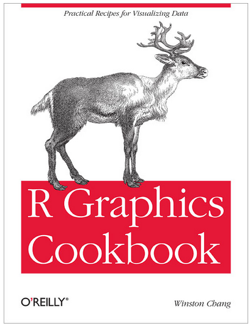

## When should you use ggplot2?
You should use ggplot to make most of your figures, because it:

* is a coherent language for visualizing data (vs. the 'plot' function, which developed in an ad-hoc way)
* makes many tasks much easier, such as: visualizing a third (z) variable; saving your plot; automating plotting and formatting tasks
* creates beautiful plots and is very flexible

I use ggplot2 to generate almost all my figures, with the exception of some spatial figures and a few specialized plots.  My experience has been that ggplot2 often chokes on larger raster or shape files.  But, there are some great resources for visualizing spatial data using ggplot2 (e.g., [ggmap](https://github.com/OHI-Science/ohiprep/blob/master/Reference/ggmapCheatsheet.pdf) and an example from [Casey O'Hara](https://github.com/eco-data-science/spatial_analysis2_R/blob/master/spatial_notes.Rmd)). 

## Good resources

* [My awesome cheatsheet](https://github.com/OHI-Science/ohiprep/blob/master/Reference/ggplot2%20cheatsheet%20v2.pdf) which I thought was the greatest until....

* [The official cheatsheet](https://www.rstudio.com/wp-content/uploads/2015/03/ggplot2-cheatsheet.pdf) came out!!!  They are both great...you should get both of them.

* I highly recommend Winston Chang's book (which provides a great overview of ggplot2) and his [website](http://www.cookbook-r.com/).


* [rvisualization.com](http://rvisualization.com/r-scripts/) has some really nice examples!

## An example in 3 easy steps

We will use my cheatsheet as a reference to make a scatterplot. We will use a sample dataset from the package `gcookbook`.
```{r scatterplot step 1}
# loading packages and data

#install.packages('gcookbook') # install if you don't have the package
library(ggplot2)     
library(gcookbook)   # source of example data
library(knitr)       # functions for knitting Rmd documents to html
library(RColorBrewer)

hw <- heightweight
kable(head(hw))

```


### Step 1: Set everything up

In this step, you will use the `ggplot` and `aes` functions to assign variables in your dataset to the x and y axes, and if desired, to other aesthetics such as, size, color, and labels.

This does not do any plotting!  It just tells ggplot how to assign the data.

```{r ggplot function, eval=FALSE}

ggplot(hw, aes(x = ageYear, y = weightLb))

```

### Step 2: Select the plot geom

This step tells ggplot what type of figure to make.  In this case, we will use geom_point which is a scatterplot.

```{r scatterplot step 2}

ggplot(hw, aes(x = ageYear, y = weightLb)) +
  geom_point()

```

Tada!!  You now have a basic plot, but you will probably want to modify a few things.

### Step 3: Fine-tune the plot

This section describes how to make some routine changes, such as:

- changing point size, shape, transparency
- changing axes labels
- fitting a linear model
- adding a reference line
- changing the overall look of the plot using existing themes
- displaying different groups of data

```{r scatterplot step 3a}

ggplot(hw, aes(x = ageYear, y = weightLb)) +
  geom_point(size = 4, shape = 15, alpha = 0.3) + #changing point size, shape, color
  labs(x = 'Age (yr)', y = "Weight (lb)", title = "Older people weigh more!") +
  stat_smooth(method = lm) +  # default is loess spline, can remove 95% confidence interval, se=FALSE
  geom_hline(yintercept = 150, color = 'orange', linetype=3, size=1) +
  theme_bw() 

```
  
Changing the color to correspond to a third variable (sex, in this case):
```{r scatterplot step 3b}

ggplot(hw, aes(x = ageYear, y = weightLb, color=sex)) +
  geom_point(size = 4, shape = 15, alpha = 0.3) + #changing point size, shape, color
  labs(x = 'Age (yr)', y = "Weight (lb)", title = "Older people weigh more!") +
  stat_smooth(method = lm, size = 1) + # default is loess spline, can remove 95% confidence interval, se=FALSE
    geom_hline(yintercept = 150, color = 'orange', linetype=3, size=1) +
  theme_bw()

```

Creating separate plots for males and females using faceting.  The arrangement of the plots can be controlled using `row_variable ~ column_variable` (use a period to indicate no variable):

```{r scatterplot step 3c}

ggplot(hw, aes(x = ageYear, y = weightLb, color=sex)) +
  geom_point(size = 4, shape = 15, alpha = 0.3) + #changing point size, shape, color
  labs(x = 'Age (yr)', y = "Weight (lb)", title = "Older people weigh more!") +
  stat_smooth(method = lm, se = FALSE) + # default is loess spline
  facet_grid(. ~ sex) + 
  theme_bw()

```

Here is a variation on the theme:

```{r scatterplot 3d}

ggplot(hw, aes(x = ageYear, y = weightLb, color=sex)) +
  geom_point(size = 4, shape = 15, alpha = 0.3) + #changing point size, shape, color
  labs(x = 'Age (yr)', y = "Weight (lb)", title = "Older people weigh more!") +
  stat_smooth(method = lm, se = FALSE) + # default is loess spline
  facet_grid(sex ~ ., scales = 'free') + 
  theme_bw()

```

## Some common figures

### histogram

```{r histogram}

ggplot(hw, aes(x = weightLb)) +
  geom_histogram()

```

Ways to modify the figure: 

```{r histogram improvements}

ggplot(hw, aes(x = weightLb)) +
  geom_histogram(fill="gray") +  ## use 'fill' (color only refers to the outline) 
  labs(y = "Number of people", x = "weight (lb)") +
  theme_bw()

```

### boxplot
The box portion of this figure represents the range of values where 50% of the data occurs.  The midline is the median.  The whiskers extend to $1.5*box$, and outliers beyond the whiskers are points. 

In this case, I demonstrate how to assign the plot a name (`bp`) so we can add elements more easily.

```{r boxplot}
bp <- ggplot(hw, aes(x = sex, y = weightLb)) +
  geom_boxplot(fill="gray") +
  labs(y = "Weight (lb)", x = "") +
  theme_bw()

bp

```


I like seeing the data used to create the boxplot, this is easy to add as points:
```{r boxplot b}

bp + 
  geom_point()   # overlay true data, jitter to see all points
  
```


There are a lot of overlapping points which makes it difficult to discern the true density of points. I will use the `geom_jitter` function, which is similar to `geom_point`, but randomly jitters the points.  
```{r boxplot c}

bp +  
  geom_jitter()

```

This looks pretty good but is more scattered than I would like.  The degree of scatter can be controlled:

```{r boxplot d}

bp +  
  geom_jitter(position = position_jitter(width = .05), alpha = 0.5)

```

### barplot
This function can be used to create a variety of styles depending on the arguments that are used.

```{r barplot}

## create a dataset:
data <- expand.grid(pet = c('dog', 'cat', 'hamster'), gender=c('m', 'f'))
data$size <- c(45, 10, 1, 40, 8, 2)

ggplot(data, aes(x=pet, y=size, fill=gender)) +
  geom_bar(stat="identity")

ggplot(data, aes(x=pet, y=size, fill=gender)) +
  geom_bar(stat="identity", position="dodge")

```

### lineplot
```{r barplot b}

ggplot(data, aes(x=pet, y=size, color=gender, group=gender)) +
  geom_line() +
  geom_point(size=5)

```

## Extra information

### Make your own themes
It is possible to make your own theme.  This is useful when you want your plots to have a consistent appearance, and you don't want to repeat a lot of code for each figure.

I created a theme that I often use for scatterplots in publications. One issue with the default ggplot2 figures is that when they are saved the axes labels can appear very small.  I increased the size of the labels to make them more readable.  

I keep my theme on Github so I can access it from anywhere.

Another theme idea: I like the general appearance of the figures at rvisualization.com.  The background is minimalistic which puts the emphasis on the data. A good project would be creating a theme based on their code. 

```{r themes, eval=FALSE}

source('https://raw.githubusercontent.com/OHI-Science/ohiprep/master/src/R/scatterTheme.txt')

ggplot(hw, aes(x = ageYear, y = weightLb)) +
  geom_point(size = 4, shape = 15, alpha = 0.3) + #changing point size, shape, color
  labs(x = 'Age (yr)', y = "Weight (lb)", title = "Older people weigh more!") +
  stat_smooth(method = lm) + 
  scatterTheme


## save the figure
ggsave('example.png', width = 6, height = 6)

```


### Dealing with color
The ggplot default colors aren't always the prettiest, and most of the time, you will want to change them.

One thing about ggplot2 that confused me for a while is that both `color` and `fill` are used to define color. For the most part, 'color' is used to color lines and outlines of polygons (e.g., histograms, bar plots, shapes 21-25), and 'fill' is used to color the rest of the area. However, point shapes are treated a bit differently and `color` is used to color the entire point.

I recommend using established color palettes, such as those from RColorBrewer.

```{r colorBrewer, fig.height=8}

display.brewer.all()

```

To select a particular ColorBrewer palette:

```{r colorBrewer b, fig.height=8}

myCols <- brewer.pal(11, "Spectral")  #choose the number of colors you want from the palette
myCols  

```

This returns a vector of colors in hexadecimal (the color language used by R).

There are many ways to assign colors in ggplot2 (so many that it can be rather confusing).  I am only going to describe the methods I have found work best for me.    

The first thing to consider is whether the variable you want to represent with color is discrete (e.g., categories, such as gender or eye color) or continuous (e.g., weight or height). 

#### Discrete variable
If you have a discrete variable, the best bets are to use `scale_color_brewer` or `scale_color_manual` (or, alternatively 'scale_fill_brewer' or 'scale_fill_manual' if you are trying to color the inside of a polygon shape).  `scale_color_brewer` provides a nice shortcut if you are going to use one of the Color Brewer palettes and do not care how the colors are assigned. `scale_color_manual` provides a lot of flexibility for assigning colors to particular categories.

```{r color discrete}

sp <- ggplot(hw, aes(x = ageYear, y = weightLb, color=sex)) +
  geom_point(size = 4, shape = 19) + 
  labs(x = 'Age (yr)', y = "Weight (lb)", title = "Older people weigh more!")  +
  theme_bw()

# using a Colour Brewer palette:
sp +
  scale_colour_brewer(palette = "Set1") 

```

In this case, I want females to be purple and males green:

```{r color discrete b}  

sp +
  scale_color_manual(values = c("purple", "darkgreen"),
                     limits = c("f", "m"),
                     labels =c("females", "males"))

```


#### Continuous variable: displayed as a discrete variable
Sometimes you have a continuous variable you want to display as categories.  In the following example, instead of mapping color to sex, we map it to height.  But, we want height to be displayed as categories (tall, medium, short).

```{r continuous to category}

# figure out quantiles I want to use:
quantile(hw$heightIn)

# use cut function to make the breaks and labels:
sp <- ggplot(hw, aes(x = ageYear, y = weightLb, 
                     color=cut(heightIn, 
                               breaks = c(-Inf, 58.7, 64.3, Inf),
                               labels = c("small", "medium", "large")))) +
  geom_point(size = 4, shape = 19) + 
  labs(x = 'Age (yr)', y = "Weight (lb)", title = "Older people weigh more!")  +
  theme_bw()

# Default:
sp 

# Some changes using scale_color_manual:

# Determine hex codes for ColorBrewer YlOrRd palette
brewer.pal(9, "YlOrRd")

sp +
  scale_color_manual(values = c('#FED976', '#FD8D3C', '#E31A1C'), # colors
                     limits =c('small', 'medium', 'large'),     # categories that map to colors
                     name = 'size',                             # legend title
                     labels = c('smallish', 'med', 'very large')) # legend category names
                    
```

#### Continuous variable
There are three general options I tend to use based on whether I want a 2 color gradient palette, 3 color diverging palette, or 4+ color gradient.

Here is the default:
```{r continuous color default}

sp <- ggplot(hw, aes(x = ageYear, y = weightLb, color=heightIn)) +
  geom_point(size = 4, shape = 19) + 
  labs(x = 'Age (yr)', y = "Weight (lb)", title = "Older people weigh more!")  +
  theme_bw()

sp

```

A two color gradient palette:
```{r continuous color gradient}

sp +
  scale_color_gradient(low = 'yellow', high = 'red')

```


A three color diverging palette:
```{r continuous color diverging}

sp +
  scale_color_gradient2(low = 'yellow', mid = 'grey', high = 'red', midpoint = 65)

```

Multiple color scale:
```{r continuous color multiple colors}

sp +
  scale_color_gradientn(colours = rev(brewer.pal(11, "Spectral")))

```

### Adding text to your figure

#### labeling points

If the text that you want to add corresponds to a variable in your data, you should use `geom_text`.

```{r labeling points}

## add some labels to the hw data
hw$name <- c("chad", "lee", "pierce", 'niles')

sp <- ggplot(hw, aes(x = ageYear, y = weightLb, color=heightIn)) +
  geom_point(size = 4, shape = 19) + 
  labs(x = 'Age (yr)', y = "Weight (lb)", title = "Older people weigh more!")  +
  scale_color_gradientn(colours = rev(brewer.pal(11, "Spectral"))) +
  theme_bw()

# The general command:
sp +
  geom_text(aes(label=name))

```

This always takes a bit of work to get right:
```{r labeling points tweaking}

sp +
 geom_text(aes(label = name), color = 'black', size = 3, vjust = 1.5) # vjust adds a value in vertical direction

```

It is usually better to only display a subset of the points.  In some cases, you might be able to simply subset the data:

```{r labeling points subsetting}

sp +
 geom_text(data=subset(hw, ageYear > 16), aes(x = ageYear, y = weightLb, label = name), 
           color = 'black', size = 3, vjust = 1.5) # vjust adds a value in 

```

Sometimes it is necessary to make a variable with the names you want displayed:

```{r labeling points new variable}

hw$name2 <- NA
hw$name2[c(2,5,10,15)] <- "niles"
kable(head(hw))

sp <- ggplot(hw, aes(x = ageYear, y = weightLb, color=heightIn)) +
  geom_point(size = 4, shape = 19) + 
  labs(x = 'Age (yr)', y = "Weight (lb)", title = "Older people weigh more!")  +
  scale_color_gradientn(colours = rev(brewer.pal(11, "Spectral"))) +
   geom_text(aes(label = name2), color = 'black', size = 5, vjust = 1.5) +
  theme_bw()

sp 

```

#### Expressions
It is also possible to add text to a particular location on the plot using expressions.  For example, we can add the R<sup>2</sup> value to the plot.
```{r labeling points subsetting 2}

# figure out what the R2 value is:
mod <- lm(weightLb ~ ageYear, data=hw)
summary(mod)

sp +
  annotate("text", x = 16, y = 60, label = 'R^2==0.37', parse = TRUE, fontface = 'bold') 
    
```

You can also use annotate to add things other than "text", such as line segments, rectangles, arrows, etc.

## Some general tips
* **qplot: Don't bother!!!**  *qplot* is a ggplot shortcut function that basically combines the ggplot and geom functions.  Basically, it makes using ggplot2 more confusing because you have to learn two ways of creating a plot.

* If the 'color' aesthetic doesn't seem to be working correctly, try 'fill'. 

* Do not bother with the official Hadley Wickham book on ggplot2 (I love Hadley Wickham too, but this book is out of date and was never that helpful to begin with).

* Use the "group" aesthetic when you want separate lines/analyses for different subsets of data.  This is often needed for geom_line plots. Oddly, sometimes this aesthetic is necessary...and other times you can get by without it. (NOTE: the grouping variable must be categorical) 

* When plotting points, use shape=19 (the default appears jagged in bitmap files!)
